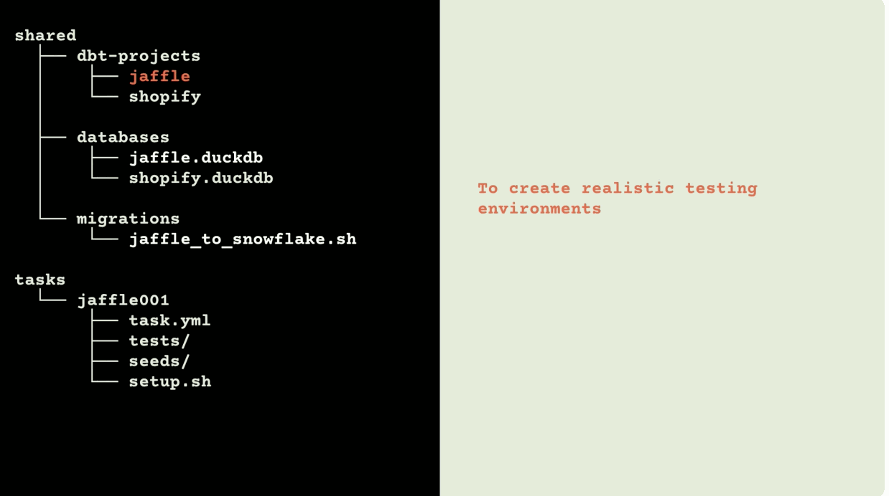

# ADE-bench

_"Lord, forgive me, I've been running, running blind in truth."_

— [Beyonce  /  "Freedom"  /  Lemonade](https://www.youtube.com/watch?v=7FWF9375hUA&t=39s)

---

## Overview

ADE-bench[^1] is a framework for evaluating AI agents on data analyst tasks. Use it to create realistic testing environments with complex evaluation criteria, that can be shared as simple files and tested in production warehouses, while making it as easy as possible to create new tasks.


[Watch an explainer video from Coalesce 2025](https://www.youtube.com/watch?v=cX2yvpqRTsA)

It does this by running each task in a separate temporary sandbox, and then evaluating the agent's work against the expected results.

## Quickstart

### 1. Clone this repo

```bash
git clone https://github.com/dbt-labs/ade-bench.git
cd ade-bench
```

### 2. Install [Docker Compose](https://docs.docker.com/compose/install/) and [`uv`](https://docs.astral.sh/uv/getting-started/installation/#installing-uv)

You might already have these, check with:

```bash
uv --version
docker compose version
```

If you don't, install them according to the links above.

### 3. Create a virtual environment and install the `ade` CLI

Reminder: `cd` into the `ade-bench` directory first.

```bash
uv venv
source .venv/bin/activate
uv pip install -e .
```

Confirm it is installed by running:

```bash
ade --help
```

[Learn more about virtual environments](https://docs.astral.sh/uv/pip/environments/#creating-a-virtual-environment), including activation instructions for Windows.

### 4. Download the [sample DuckDB databases](https://drive.google.com/drive/folders/1CNS_8mf81to02868HA-celmcPEFu4BPE) to `/shared/databases/duckdb`

Or run the following command:

```bash
uv run --with gdown gdown --folder https://drive.google.com/drive/folders/1CNS_8mf81to02868HA-celmcPEFu4BPE -O shared/databases/duckdb
```

### 5. Checkpoint: try running a task without any LLMs

```bash
ade run simple001 --db duckdb --project-type dbt --agent sage
```

<details><summary>You should see output like this:</summary>

<pre>
$ ade run simple001 --db duckdb --project-type dbt --agent sage
14:58:07 | system                           | START        | STARTING HARNESS RUN
14:58:07 | system                           | START        | Run ID: 2025-12-05__14-58-07
14:58:07 | system                           | START        | Running with duckdb + dbt. Found 1 tasks of 1 requested tasks.
┏━━━━━━━━━━┳━━━━━━━━━━━━━━━━━━━━━━━━━━━━━━━━━━┳━━━━━━━━━━━━━━┳━━━━━━━━━━━━━━━━━━━━━━━━━━━━━━━━━━━━━━━━━━━━━━━━━━━━━━━━━━━━━━━━━━━━━━━━━━━━━━━━━━━━━━━━━━━━━━━━━━━━━━┓
┃ Time     ┃ Task                             ┃ Stage        ┃ Message                                                                                              ┃
┡━━━━━━━━━━╇━━━━━━━━━━━━━━━━━━━━━━━━━━━━━━━━━━╇━━━━━━━━━━━━━━╇━━━━━━━━━━━━━━━━━━━━━━━━━━━━━━━━━━━━━━━━━━━━━━━━━━━━━━━━━━━━━━━━━━━━━━━━━━━━━━━━━━━━━━━━━━━━━━━━━━━━━━┩
│ 14:58:32 │ simple001                        │ ✓ ✓ ✓  DONE  │ PASS - dbt test results - Pass: 2, Fail: 0, Total: 2                                                 │
│ ──────── │ ──────────────────────────────── │ ──────────── │ ──────────────────────────────────────────────────────────────────────────────────────────────────── │
│ 14:58:32 │ SUMMARY                          │              │ Run 1 of 1 tasks, 1 successful (100.0%)                                                              │
└──────────┴──────────────────────────────────┴──────────────┴──────────────────────────────────────────────────────────────────────────────────────────────────────┘
14:58:32 | system                           | FINISH       | Generated HTML dashboard.
14:58:32 | system                           | FINISH       | Harness run completed: 1 of 1 tasks successful

======================================== RESULTS SUMMARY ========================================

+-------------+----------+----------------+---------+----------+------------+------------+--------+----------------+-----------------+----------------+---------+
| Task        | Result   | Failure Type   | Tests   | Passed   | Passed %   | Time (s)   | Cost   | Input Tokens   | Output Tokens   | Cache Tokens   | Turns   |
|-------------+----------+----------------+---------+----------+------------+------------+--------+----------------+-----------------+----------------+---------|
| simple001   | p        |                | 2       | 2        |            | 0          | $0.00  | 0              | 0               | 0              | 0       |
|             |          |                |         |          |            |            |        |                |                 |                |         |
| TOTAL (n=1) | 100%     |                | 2       | 2        | 100%       | 0          | $0.00  | 0              | 0               | 0              | 0       |
+-------------+----------+----------------+---------+----------+------------+------------+--------+----------------+-----------------+----------------+---------+

For more details, run the command below:
ade view
</pre>
</details>

### 6. Configure one or more LLM API keys

Make a copy of `.env.example` and rename it to `.env`, then provide your preferred API keys in the specified locations. See [Configuration](#configuration) for a worked example.

### 7. Run all tasks

```bash
ade run all --db duckdb --project-type dbt --agent claude
```

### 8. Go beyond

- Use the dbt Fusion engine instead of dbt Core with `--project-type dbt-fusion` ([set up Snowflake](#snowflake-setup) first)
- Enable the dbt MCP server with the `--use-mcp` flag (requires Snowflake, see [MCP](#enabling-the-mcp-server) section)
- [Contribute additional tasks or datasets](/docs/CONTRIBUTING.md)

---

## An introduction to how ADE-bench works

ADE-bench has three primary components:

1. Tasks
2. Shared databases
3. Shared dbt projects

Each task represents a request that might be made to an agent. Though each task can include multiple evaluation criteria (e.g., it may require multiple models to be updated, or a model to have the correct SQL query and materialization configuration), the task is the primary unit of evaluation in ADE-bench.

When ADE-bench is asked to solve a task, here is what happens:

1. **Copy the project into a sandbox.** ADE-bench creates a sandbox environment (i.e., a Docker container) for the task. It loads the corresponding project into the container, and creates a sandbox environment for the corresponding database (see "How databases work" below).
2. **Take a first snapshot.** Once the project is set up, ADE-bench takes a snapshot of all the files in the project. This allows it to log the changes made by additional setup tasks and by the agent.
3. **Run task-specific setup script.** After taking a snapshot, ADE-bench runs any of the task's additional setup scripts. These might make changes to the project, update the data in the database, or make changes to the project so that it can be run against a different type of databases (see "Sharing projects across databases.")
4. **Take another snapshot.** ADE-bench takes another snapshot to log what changes made in the step above.
5. **Ask the agent to do stuff.** The environment is handed to the agent, which then tries to resolve the task.
6. **Take a final snapshot.** Once the agent declares itself done, ADE-bench takes a third snapshot.
7. **Evaluate the result.** The changes are evaluated against the tests specified in the task. If all the tests pass, the task passes. **Note:** ADE-bench includes automatic ways to compare tables to one another. For example, if you want to evaluate a task by seeing if the agent created the correct `dim_users` table, you can define this table in the task configuration, and the comparison test is generated automatically.
8. **Clean up the sandbox.** Once the task has recorded its results, ADE-bench deletes the container.

---

## Usage

ADE-bench runs with the `ade` CLI command. Here is an example command for running tasks:

```bash
ade run \
  foo001 foo002 \ # The tasks to run. See the task selection list immediately below for more details.
  --db snowflake \ # Which database variant to run
  --project-type dbt \ # Which project variant to run (currently dbt or dbt-fusion)
  --agent sage \ # Which agent to use (e.g., `sage`, `claude`, `codex`)

  --model claude-opus-4-5-20251101 \ # Optional; which specific model to use for different agents.
  --exclude_task_ids foo001 \ # Optional; if you run all tasks, you can exclude tasks with this flag.
  --n-concurrent-trials 4 \ #  Optional; sets trial concurrency limit; defaults to 4.
  --n-attempts 1 \ # Optional; sets times to run each task; defaults to 1.
  --max-episodes 50 \ # Optional; the maximum number of calls to an agent's LM; defaults to 50.
  --seed \ # Optional; flag for creating solution seed CSVs !! DESTRUCTIVE !! RUN WITH CAUTION !! SEE BELOW !!
  --no-diffs \ # Optional; disables taking snapshots of diffs for faster performance.
  --persist \ # Optional; keeps the container alive after the trial is over or is aborted.
  --use-mcp \ # Optional; creates an dbt MCP server for the agent. Note: Not all agents and databases are supported.
```

See also: [complete usage documentation](/docs/CLI.md).

### Task selection

There are several ways to select tasks to run:

```bash
ade run airbnb001  # Run a specific task
ade run f1006.hard  # Run a specific task with a specific variant
ade run airbnb001 airbnb002  # Run multiple tasks
ade run all  # Run all ready tasks
ade run @coalesce  # Run an experiment set
ade run f1+ simple+  # Run wildcard patterns
```

---

## Task Configuration

Before getting into the details, it's useful to see how tasks are configured. This will help define the outline for how ADE-bench works, and the sections below will fill in the details.

Each task folder contains a handful of files:

- `task.yaml` - The task's configuration. This is an important file, so all the details are below.
- `setup.sh` – A setup script that runs before the agent is given the task, for modifying files and doing other computer stuff.
- `setup/` – (Optional) A directory containing files that the setup script can use. For example, suppose you want to replace `a_good_working_file.sql` with `one_with_a_bug.sql`. Put the one with a bug here and use `setup.sh` to replace it. This lets you modify the project for the specific task, without having to make changes to the shared project.
- `solution.sh` – A script that solves the task. The sage agent is a agent that just runs this script. See "[The sage agent](#the-sage-agent)" below for more.
- `solutions/` – (Optional) Files that are available to the solution script. This is exactly analogous to the `/setup` directory for the setup script.
- `tests/` - dbt tests that are used to evaluate the trial. For a trial to pass, all the tests in this directory must pass. You can add manual tests, and if you include `solution_seeds` in the task configuration, tests will get added here automatically when a task is run. Automatically generated tests are appended with the name `AUTO_`. See "[How trials are evaluated](#how-trials-are-evaluated)" below for more.
- `seeds/` - CSVs that are used when evaluating the automatically-generated equality tests.

The task is defined in the `task.yaml` file:

```yaml
# task.yaml
task_id: The name of the task, which should match the name of the task directory.
status: An indicator of the task's development status. [ready | dev | open]
description: A description of what the task does
notes: |-
  Optional notes about the task, things to add to it, issues with it, etc.
prompts: #
  # Tasks can have multiple prompt variants to see how well agents resolve issues
  # with different levels of detail. The base prompt is required; additional prompt
  # variants are optional. Each prompt will run as its own trial in its own sandbox.
  - key: base
    prompt: |-
      The prompt to give to the agent.
  - key: hard
    prompt: |-
      Optional prompt variants.
author_name: The name of the task author.
author_email: The author's email.
difficulty: How hard the task is.
category: The category of problem the task is testing.
tags:
  # Additional tags to help with organization
  - dbt
  - jinja

# An optional script to run after the agent runs, and before the tests are evaluated.
# This should be used if
#  1. the agent might update a file as part of the task
#  2. and might not run dbt,
#  3. which should be considered a success,
#  4. but dbt needs to run to evaluate the tests.
test_setup: |-
  dbt run --select obt_product_inventory

# ADE-bench will automatically do several things with the tables listed here:
#  1. Create solution seeds (called `solution__[table_name]`) after the agent runs.
#  2. Create a dbt test that checks for the existence of this table
#  3. Create a test to compare the table to corresponding solution seed.
#
# As is shown for with the tables below, you can:
#  1. Exclude some columns from the equality test
#  2. Only include certain columns in the equality test
#  3. Disable the creation of both the existence and equality tests.
#  4. Specify alternate solution seeds (for tasks with multiple valid answers)
solution_seeds:
  - table_name: dim_products

  - table_name: fct_sales
    include_columns:
    - id
    - item_name_displayed
    - item_name_actual

  - table_name: fct_transactions
    exclude_columns:
    - bribe_amount_usd

  - table_name: generated_income_statement
    exclude_tests:
    - equality_test # Can also be `existence_test`

  - table_name: sec_filing_report
    alternates:
    - sec_filing_report_with_fudges

# These are the different database and project variants that the task supports
# If no migration directory is provided, then no migration script will run.
# If one is provided, it will be run against the project prior to the the task's
# setup.sh script.
variants:
- db_type: duckdb
  db_name: enron # Ignored if db_path is present
  db_path: /absolute/path/to/custom.duckdb  # Optional, overrides db_name lookup
  project_type: dbt
  project_name: enron # Ignored if project_path is present
  project_path: /absolute/path/to/dbt/project # Optional, overrides project_name

- db_type: snowflake
  db_name: enron
  project_type: dbt
  project_name: enron
  migration_directory: enron__duckdb_to_snowflake
```

---

## How it works, in detail

We skimmed over lots of details in the section above. This next section explains the painful tedium of those details.

### How trials are evaluated

After the agent runs, tasks are graded via dbt tests. You can add whatever manual tests you want to this directory. Additionally, ADE-bench will automatically create tests for you based on solution seeds in your task.

More specifically, when the agent completes its work, several things happen:

1. If there are solution_seeds defined in the `task.yaml` file, the `\seeds` directory is copied into the sandbox. ADE-bench then runs `dbt seed` to create these tables in the database environment.
2. The existing test directory in the sandbox is replaced with the tests in the `\tests` directory of the task folder. If a task has no solution seeds, then it will only have manual tests; if a task has solution seeds, ADE-bench will automatically generate two tests (`AUTO_{table_name}_equality.sql` and `AUTO_{table_name}_existence.sql`) and copy those. **Note:** ADE-bench automatically removes and regenerates all `AUTO_` tests prior to evaluating each trial, so if you update these files directly, your changes will probably get wiped away.
3. The tests in that directory are run and the results are recorded. If all of them pass, the task passes. If any fail, the task fails.

### How databases work

ADE-bench currently supports these database types:

- DuckDB
- Snowflake

#### DuckDB

DuckDB databases should be stored in `shared/databases/duckdb`. When a task is run against a DuckDB database, ADE-bench simply copies the `.duckdb` file from the shared directory into the task container.

Alternatively, if you have an existing DuckDB file that you want to reference, you can specify an absolute path to a DuckDB file using the `db_path` field in the variant configuration.

#### Snowflake

Snowflake is more complicated.

When ADE-bench runs a task, three DDL scripts (found in `/ade_bench/setup/snowflake_setup.py`) are executed by the admin user defined in `.env` (see [Snowflake setup](#snowflake-setup)):

1. Clone the original database, with the name `TEMP_ADE_[name_of_task]_DATABASE`. (If that database already exists, it is first dropped, so this will reset any prior trials of that task.)
2. Create a new Snowflake user and role for the trial. The user is `TEMP_ADE_[name_of_task]_USER`; the role is `TEMP_ADE_[name_of_task]_ROLE`. If these already exist, they are also dropped.
3. Grant the appropriate permissions to the user and role. Snowflake is very particular about all of this; if you want to see the specifics, go to the `.py` file above.

The Snowflake credentials for this new user are added to `profiles.yml` in the dbt project. (Technically, this happens when the dbt project is set up and not after the Snowflake environment is set up, but, same same.)

The trial is then conducted using the user created in the step above. Once the trial is complete, the users, roles, and databases all persist in the Snowflake account. If you want to clean these up, you can run this query, which will generate a list of drop statements you can run all at once in the Snowflake UI:

<details><summary>Generate drop statements</summary>

<pre>
select
  'user' as object_type,
  'drop user if exists "' || name || '";' as drop_statement
from snowflake.account_usage.users
where deleted_on is null
  and name ilike 'TEMP_ADE_%'

union all

select
    'role' as object_type,
    'drop role if exists "' || name || '";' as drop_statement
from snowflake.account_usage.roles
where deleted_on is null
  and name ilike 'TEMP_ADE_%'

union all

select
    'database' as object_type,
    'drop database if exists "' || database_name || '";' as drop_statement
from snowflake.account_usage.databases
where deleted is null
  and database_name ilike 'TEMP_ADE_%'

order by object_type, drop_statement;
</pre>
</details>

### Viewing results

As ADE-bench runs, it will tick through the progress of each trial. After the entire suite runs, it will print a summary of the results. To view a more detailed view of the results, run:

```bash
ade view
```

This will open a local HTML page that includes much more detail, including details for each task:

- **Results**: Detailed JSON results of the trial.
- **Panes**: Terminal output from the setup, agent, and test phases of the trial.
- **Diffs**: File changes during task setup and changes made by the agent. If ADE-bench is run with the `--no-diffs` flag, these will not be available.

### Configuring agents

ADE-bench currently supports the following agents:

- Claude Code - `--agent claude`
- OpenAI Codex - `--agent codex`
- Gemini CLI - `--agent gemini`

Optionally, you can include a `--model {model-id}` flag to specify which model to use. For more information on models and their IDs, refer to documentation provided by [Claude](https://platform.claude.com/docs/en/about-claude/models/overview), [Codex](https://developers.openai.com/codex/models/), and [Gemini](https://geminicli.com/docs/cli/model/).

The following commands are run to call each agent:

```bash
# CLAUDE
claude --output-format json -p {task_prompt} --model {model-id} \
  --allowedTools Bash Edit Write NotebookEdit WebFetch

# CODEX
printenv OPENAI_API_KEY | codex login --with-api-key && \
codex --ask-for-approval never --model {model-id} exec --sandbox workspace-write --skip-git-repo-check {task_prompt}

# GEMINI
gemini --output-format json --yolo --prompt {task_prompt} --model {model-id}
```

Configuration files for each agent are found in the `/shared/config` directory. You can use `CLAUDE.md` to configure Claude Code, `AGENTS.md` to configure Codex, and `GEMINI.md` to configure Gemini.

### Enabling the MCP server

If run with the flag `--use-mcp`, ADE-bench will create a dbt MCP server that the agent is allowed to use. The following databases and agents are supported:

- Databases: `snowflake` (duckdb doesn't support multiple simultaneous connections)
- Agents: `claude`, `codex`, `gemini`

Because the server runs locally, it only has access to the [CLI tools](https://github.com/dbt-labs/dbt-mcp#tools). The others are disabled, because they require access to the dbt platform.

### The Sage agent

The sage agent is not really an agent—or, it's a very dumb agent. It's an agent that runs `$ bash solution.sh` and then shuts itself down.

In other words, the sage agent is the answer key to the task. When ADE-bench is run where `--agent sage` all the tests should pass. If they don't, something is wrong with the tasks themselves. So, it's important for tasks to have a solution script to make sure that the task is correctly configured.

**Note**: The `solution.sh` script might be different for different database and project variants. More on how to handle this is discussed in [the contributing guide](/docs/CONTRIBUTING.md#sharing-projects-across-databases-and-project-types).

---

## Configuration

Configuration is all managed through the `.env` file. Create this file (if it doesn't already exist) by making a copy of `.env.example`. It's fairly self-explanatory, but for completeness, why not:

```env
# API Keys for LLM providers
ANTHROPIC_API_KEY=[API key for Anthropic, if you want to run Claude Code agents]
OPENAI_API_KEY=[API key for OpenAI, if you want to run Codex agents]
GEMINI_API_KEY=[API key for Gemini, if you want to run Gemini CLI]

# Snowflake configuration
# This is the admin user as described in the Snowflake setup below.
SNOWFLAKE_ACCOUNT=[ORGANIZATION_NAME-ACCOUNT_NAME]
SNOWFLAKE_USER=ADE_BENCH_ADMIN_USER
SNOWFLAKE_ROLE=ADE_BENCH_ADMIN_ROLE
SNOWFLAKE_PASSWORD=[the user's password]
SNOWFLAKE_WAREHOUSE=[the warehouse you want this user and all ade-bench agents to use]

# Timeout Settings (in seconds)
# These are default timeouts for each stage of the harness.
SETUP_TIMEOUT_SEC=120 # How long setup tasks can run
DEFAULT_AGENT_TIMEOUT_SEC=300 # How long the agent can run
DEFAULT_TEST_TIMEOUT_SEC=180 # How long test scripts can run
CLEANUP_TIMEOUT_SEC=60 # How long cleanup scripts can run

# Docker Configuration
DOCKER_DEFAULT_PLATFORM=linux/amd64

# Logging
# This stuff is for nerds.
USE_DYNAMIC_LOGGING=TRUE # Set to FALSE if you want normal logs and not a fancy table.
FILE_DIFF_EXCLUDE_PATHS=/tmp,/logs,/var,/target,/build,/node_modules
LOG_LEVEL=INFO
```

### Snowflake setup

#### 1. Create a trial Snowflake account

> [!CAUTION]
> Do not connect ADE-bench to your production Snowflake account when using shared datasets!
>
> It assumes it has free rein to create and drop objects in the database, and runs a lot of dangerous DDL statements in the process.

[Sign up for a trial Snowflake account](https://signup.snowflake.com/).

#### 2. Create an administrative user and role

ADE-bench will use this user to create an empty testing environment (database, user, role) at the beginning of each trial.

Run the following commands:

```sql
-- Put a secure password here, inside 'single quotes'.
-- Make sure you keep the semicolon after the quotes.
SET PASSWORD_VARIABLE= ;

-- Create role
CREATE OR REPLACE ROLE ADE_BENCH_ADMIN_ROLE;

-- Configure role
GRANT CREATE DATABASE ON ACCOUNT TO ROLE ADE_BENCH_ADMIN_ROLE;
GRANT MANAGE GRANTS ON ACCOUNT TO ROLE ADE_BENCH_ADMIN_ROLE;
GRANT CREATE USER ON ACCOUNT TO ROLE ADE_BENCH_ADMIN_ROLE;
GRANT CREATE ROLE ON ACCOUNT TO ROLE ADE_BENCH_ADMIN_ROLE;
GRANT USAGE ON WAREHOUSE COMPUTE_WH TO ROLE ADE_BENCH_ADMIN_ROLE;

-- Create admin user
CREATE OR REPLACE USER ADE_BENCH_ADMIN_USER
    PASSWORD=$PASSWORD_VARIABLE
    DEFAULT_ROLE=ADE_BENCH_ADMIN_ROLE
    MUST_CHANGE_PASSWORD=FALSE
    TYPE=LEGACY_SERVICE
    DEFAULT_WAREHOUSE=COMPUTE_WH;

-- Configure admin user
GRANT ROLE ADE_BENCH_ADMIN_ROLE TO USER ADE_BENCH_ADMIN_USER;


SELECT 'SNOWFLAKE_ACCOUNT=' || CURRENT_ORGANIZATION_NAME() || '-' || CURRENT_ACCOUNT_NAME() as ".env values"
UNION ALL
SELECT 'SNOWFLAKE_USER=ADE_BENCH_ADMIN_USER'
UNION ALL
SELECT 'SNOWFLAKE_PASSWORD=' || $PASSWORD_VARIABLE
UNION ALL
SELECT 'SNOWFLAKE_WAREHOUSE=' || CURRENT_WAREHOUSE()
UNION ALL
SELECT 'SNOWFLAKE_ROLE=ADE_BENCH_ADMIN_ROLE'
;
```

#### 3. Add Snowflake credentials to your `.env` file

This is the same file you created when specifying your API key.

```env
SNOWFLAKE_ACCOUNT=[ORGANIZATION_NAME-ACCOUNT_NAME]
SNOWFLAKE_USER=ADE_BENCH_ADMIN_USER
SNOWFLAKE_ROLE=ADE_BENCH_ADMIN_ROLE
SNOWFLAKE_PASSWORD=[the user's password]
SNOWFLAKE_WAREHOUSE=[the warehouse you want this user and all ade-bench agents to use]
```

_Snowflake is deprecating password-based authentication, which makes this very annoying. For now, you can get around this by making this user `LEGACY_SERVICE` user, though that will eventually go away. A problem for our future selves, who might be able to solve it with the help of these [dbt](https://docs.getdbt.com/docs/cloud/connect-data-platform/connect-snowflake) and [Snowflake](https://docs.snowflake.com/en/user-guide/security-mfa-rollout#deprecation-timeline) docs._

#### 4. Migrate DuckDB databases to Snowflake

> [!CAUTION]
> Do not connect ADE-bench to your production Snowflake account when using shared datasets!
>
> It assumes it has free rein to create and drop objects in the database, and runs a lot of dangerous DDL statements in the process.

ADE-bench includes a command to migrate all of the DuckDB files in `/shared/databases/duckdb` into their own databases (matching the name of the DuckDB database) in the Snowflake account in your `.env` file.

```bash
ade migrate duckdb-to-snowflake --use-database-export
```

```bash
# Only foo.duckdb and bar.duckdb
ade migrate duckdb-to-snowflake --include foo bar

# All but bar.duckdb
ade migrate duckdb-to-snowflake --exclude bar
```

### Anthropic Claude setup

1. Login at <https://platform.claude.com>
1. Go to <https://platform.claude.com/settings/keys>
1. Create API key
1. Create in Workspace: Default
1. Name your key: whatever you want :)
1. Save the key in a secure location
1. Assign the key to `ANTHROPIC_API_KEY` within the `.env` file

---

## Tips! Tricks! Other things we recommend!

- **Disable diffs to speed things up.** If you're trying to run a bunch of tasks, or testing something where you don't care about looking at diffs, use the `--no-diffs` flag. Diffs can be slow, and ADE-bench will run faster if they're turned off.
- **View all the tasks.** Running `ade view tasks` will print a summary table of all the tasks in ADE-bench. You can also run ``ade view tasks --copy` to copy a more detailed summary of the tasks to your clipboard.

---

## Acknowledgements

ADE-bench was created by [Benn Stancil](https://benn.website/) with support from [dbt Labs](https://www.getdbt.com/) and [Macro](https://getmacro.com/). Their contributions to this project are what made it possible; you can thank both by checking out their other work.

ADE-bench also borrowed heavily from [Terminal-Bench](https://github.com/laude-institute/terminal-bench) and [Spider 2.0](https://github.com/xlang-ai/Spider2/), without which none of this would exist:

- The Terminal-Bench Team. (Apr 2025). _Terminal-Bench: A Benchmark for AI Agents in Terminal Environments_. Available: <https://github.com/laude-institute/terminal-bench>
- Fangyu Lei, Jixuan Chen, Yuxiao Ye, Ruisheng Cao, Dongchan Shin, Hongjin Su, Zhaoqing Suo, Hongcheng Gao, Wenjing Hu, Pengcheng Yin, Victor Zhong, Caiming Xiong, Ruoxi Sun, Qian Liu, Sida Wang, & Tao Yu. (2024). _Spider 2.0: Evaluating Language Models on Real-World Enterprise Text-to-SQL Workflows._  Available: <https://arxiv.org/abs/2411.07763>

## Contact?

If you want to learn more or get involved, you can find us in #tools-ade-bench in the [dbt Labs community Slack](https://www.getdbt.com/community/join-the-community). Also, feel free to reach out to Benn at <benn.electronicmail@gmail.com>.

---

[^1]: ADE-bench is short for "Analytics and data engineering benchmark," and is pronounced ~lemon~ade-bench and not AYE-DEE-EE-bench, because that is how [we should pronounce things](https://en.wikipedia.org/wiki/SQL) around here.
